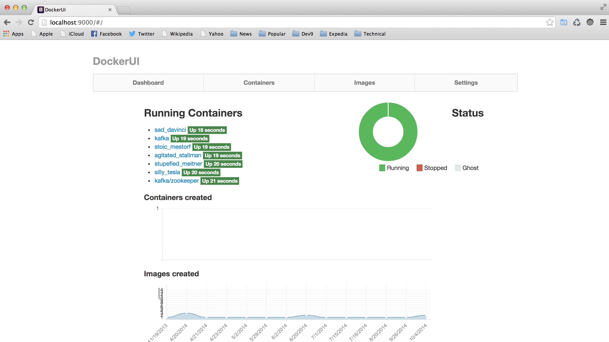

# Development Environment

This project is a derivative of the excellent work in RelateIQ's [Instant Development Environment](https://github.com/relateiq/docker_public).

## Installation:

### Linux

Install Virtualbox based off the [installation instructions](https://www.virtualbox.org/wiki/Linux_Downloads).

### MacOS

#### Install Homebrew

First, install [Homebrew](http://brew.sh/).

```
ruby -e "$(curl -fsSL https://raw.github.com/mxcl/homebrew/go)"
```

#### Install Virtualbox and Vagrant

Install VirtualBox and Vagrant using [Brew Cask](https://github.com/phinze/homebrew-cask).

```
brew tap phinze/homebrew-cask
brew install brew-cask
brew cask install virtualbox
brew cask install vagrant
```

## Check out the repository

```
git clone https://github.com/fastnsilver/devbox.git
cd devbox/devenv
vagrant up
```

After Guest Additions is in, reload the vagrant:

```
vagrant reload
```

## Update devenv

This will build and pull all the images from the server and update Docker's configuration for DockerUI.
(Recommendation: take an extra-long coffee-break).

```
./bin/devenv update
vagrant reload
```

## Run devenv start

Start the devenv container:

```
./bin/devenv start
```

You should see console output like...

```
$ ./bin/devenv start
Starting applications...
Started ZOOKEEPER in container 4436ec3749afe61b7cd90f8e9d883070dfa18b755a6a480cf69f27c85a2dc8d4
Started REDIS in container f3b143b04723508c6dd4b6aed3d0a1e99545551bd5a840dd33fadc438a8be65c
Started OPSCENTER in container 2f928f697813ac1307eba6b5550bfbf9a112e31d5fa360142364b67c2c7c3e6e
Started CASSANDRA NODE cass1 in container b363eef7badde5c4055327d3777d3361dfebca04e6d8b1c67c3857b08c96daf1
Started CASSANDRA NODE cass2 in container 535da93ca6db0b3a666edc51eba6fc279716a244d1d95a1fe94511264aaec0e3
Started CASSANDRA NODE cass3 in container 70b6f66eeee9c2e4930fa4bb45db7503b2a27f1d02d29eaf2fe7ee9895507d2e
Started CASSANDRA NODE cass4 in container 7d016779cdacfa3c5f71840d28054026e88d201531cf3b9865638fc99bb06d25
Started CASSANDRA NODE cass5 in container 8e79b1dd27850ffb11f1e03a92ec7402aa1a698fafdf6a9fd3df6ab6f1edf491
Registering cluster with OpsCenter
  % Total    % Received % Xferd  Average Speed   Time    Time     Time  Current
                                 Dload  Upload   Total   Spent    Left  Speed
100   171    0    14  100   157      0     10  0:00:15  0:00:14  0:00:01     0
Go to http://172.17.0.112:8888/
Started DYNAMODB in container 459d5083ef03fb9c487131f5768c6221e6271b1037b695dc3699b670f894ec76
Started ELASTICSEARCH in container 7812da86225500c32367bcff453a9e482dd17a28f9bd8be22e990ecda5c6d15b
Started MONGO in container e549a9b742d67795a2c7f448ebaa12445fbd9c5d8dc450a883214f2c74df5ca0
Started KAFKA in container 77030fe39e63e5efe5bf5f32f295b0cd258b4b765a3b97be253c042a65ec9ef9
Started RABBITMQ in container 791237508e5de350045de05caed30369e838943e6e4fbc488617f793177a8b73
Started RIEMANN in container 1ff7deb51667fd0455131c24e56bf8f03ac0a5f5ec1840463807d027f758a25c
Started DOCKERUI in container 004541e7dcdd83911c7f483f873f70ff0558a9e0757dd53e558b28fc2209b766
Connection to 127.0.0.1 closed.
```

Now visit [http://localhost:9000/](http://localhost:9000/) and you should see your containers.



## Other commands

```
Usage: ./bin/devenv {start|stop|kill|rm|update|restart|status|ssh}
```
