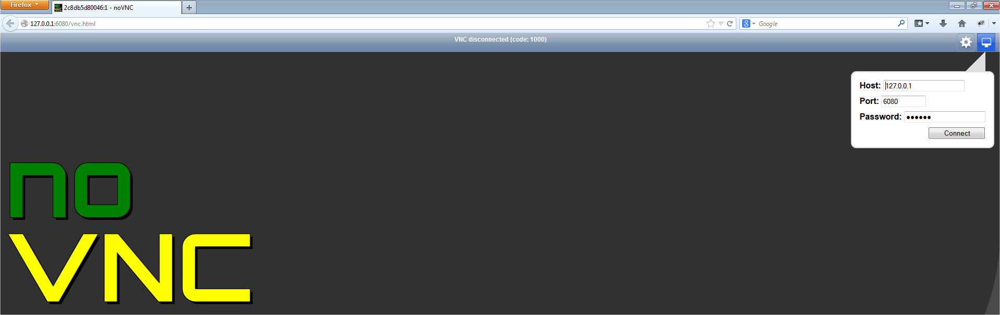
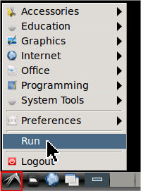
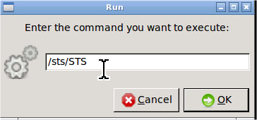
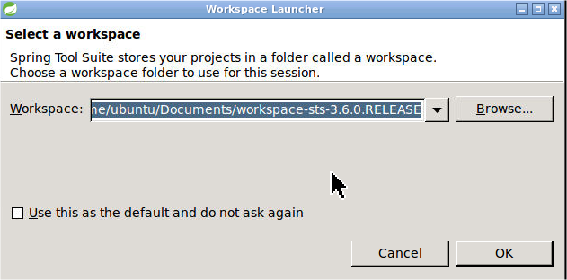
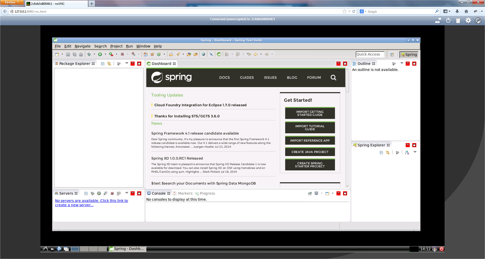
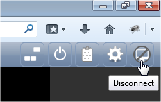

# SpringSource ToolSuite

## Overview

This Docker container is based upon the excellent [work](https://github.com/fcwu/docker-ubuntu-vnc-desktop) done by Doro Wu.

## Container 
* [Spring Source ToolSuite](http://spring.io/tools/sts) = 3.6.0.RELEASE
* [Ubuntu](http://www.ubuntu.com/download) = 14.04 (see [phusion/baseimage](http://phusion.github.io/baseimage-docker/))
* Oracle [JDK](http://www.oracle.com/technetwork/java/javase/downloads/jdk8-downloads-2133151.html) = 8
* [noVNC](http://kanaka.github.io/noVNC/screenshots.html) 

## Requirements 

### Windows

Download and install [VirtualBox](http://download.virtualbox.org/virtualbox/4.3.12/VirtualBox-4.3.12-93733-Win.exe)

Download and install [Boot2Docker](https://github.com/boot2docker/windows-installer/releases/download/v1.1.1/docker-install.exe)

Double-click the boot2docker icon on your desktop.

### Mac OS X
Install [Homebrew](http://brew.sh/)

* Open Terminal and cut-and-paste the following

    `ruby -e "$(curl -fsSL https://raw.github.com/Homebrew/homebrew/go/install)"`

Preliminaries
    
    brew update
    brew tap phinze/homebrew-cask
    brew install brew-cask
    
Install VirtualBox with

    brew cask install virtualbox

Install boot2docker with

    brew install boot2docker
    
Install Docker with

    brew install docker
    
Run boot2docker with

    boot2docker init
    boot2docker up
    
    
## Installation

    boot2docker ssh -L 6080:localhost:6080
    git clone https://github.com/fastnsilver/devbox.git
    cd devbox/sts
    chmod +x *.sh
    ./build.sh 

## Startup 

### within boot2docker    
    
    docker run -i -t -p 6080:6080 -P --name sts-base fans/sts-base bash

### from your desktop

Browse to `http://127.0.0.1:6080/vnc.html`

Authenticate with password `ubuntu`

Open STS

## Shutdown

### from your desktop

Disconnect

Close your browser window

### within boot2docker

    docker ps
    docker stop <cid>

`<cid>` above is the container id of the running container

## Screenshots

